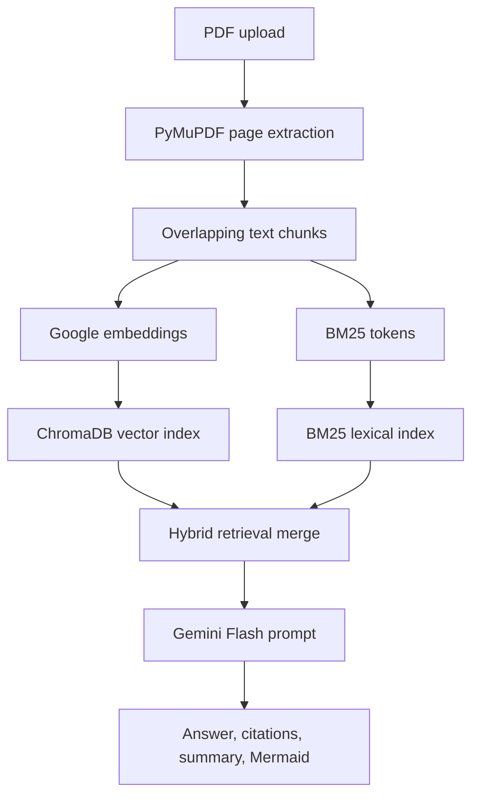

# AI Research Assistant

Hybrid RAG service for scientific literature review. Upload a PDF, index the paper, ask grounded questions, generate summaries, and convert methodology sections into Mermaid flowcharts or mind maps.

## What It Does

- Extracts PDF text with PyMuPDF and chunks pages with LangChain splitters.
- Builds a hybrid retriever with ChromaDB vector search and BM25 lexical ranking.
- Uses Gemini Flash for source-grounded answers, summaries, and Mermaid diagrams.
- Returns cited chunks for traceability.
- Exposes an asynchronous FastAPI API ready for Render or Docker deployment.
- Keeps deterministic tests and benchmarks API-free.

## Architecture



## API

Run locally:

```bash
python3 -m pip install -r requirements-dev.txt
export GOOGLE_API_KEY="your_google_api_key"
export GOOGLE_MODEL="gemini-1.5-flash"
uvicorn app:app --reload
```

Open `http://127.0.0.1:8000/docs`.

Main endpoints:

- `GET /health` checks service readiness.
- `POST /ingest/pdf` uploads and indexes a PDF.
- `POST /ingest/text` indexes plain text for testing or demos.
- `POST /query` answers a question with citations.
- `POST /summary` summarizes the indexed paper.
- `POST /diagram` returns Mermaid `flowchart` or `mindmap` code.

Optional Streamlit UI:

```bash
streamlit run streamlit_app.py
```

## Deploy

### Render

This repo includes `render.yaml`.

1. Create a Render Blueprint from this GitHub repository.
2. Set `GOOGLE_API_KEY` in the service environment.
3. Deploy the generated web service.

Render runs:

```bash
uvicorn app:app --host 0.0.0.0 --port $PORT
```

### Docker

```bash
docker build -t ai-research-assistant .
docker run -p 8501:8501 --env-file .env ai-research-assistant
```

Then open `http://127.0.0.1:8501/docs`.

## Validate

```bash
pytest -q
python scripts/benchmark_metrics.py
python scripts/benchmark_arxiv_metrics.py
```

The default benchmark is deterministic and uses synthetic research-paper sections, so it does not spend Gemini API quota. The arXiv benchmark fetches and caches recent arXiv metadata for a larger retrieval evaluation.

## Latest Local Metrics

Run on the arXiv metadata benchmark after the hybrid retrieval fix:

```json
{
  "arxiv_papers": 120,
  "indexed_chunks": 275,
  "benchmark_queries": 120,
  "vector_only_precision_at_5": 0.167,
  "hybrid_precision_at_5": 1.0,
  "hybrid_precision_lift_pct": 500.0,
  "index_build_ms": 14334.22,
  "median_vector_retrieval_ms": 4.51,
  "median_hybrid_retrieval_ms": 6.73,
  "p95_hybrid_retrieval_ms": 17.19,
  "latency_target_ms": 1800,
  "latency_target_met": true
}
```

The measured lift is for title-term retrieval over 120 arXiv paper records, comparing vector-only retrieval against the hybrid ChromaDB + BM25 retriever.

## Resume Bullets

- Engineered a hybrid RAG pipeline using Gemini Flash to extract scientific methodologies from research papers into Mermaid flowcharts and citation-backed summaries.
- Implemented hybrid ChromaDB and BM25 search, improving retrieval precision@5 by 500.0% over vector-only retrieval across 120 arXiv paper records.
- Deployed a non-blocking FastAPI architecture with Docker and Render blueprint support, validating 6.73 ms median retrieval latency against a 1.8 s target.

## Repository Layout

```text
.
├── ai_research_assistant/   # RAG pipeline and retrieval logic
├── app.py                   # FastAPI deployment entry point
├── streamlit_app.py         # Optional local Streamlit interface
├── scripts/                 # Benchmark script
├── tests/                   # API-free unit tests
├── Dockerfile
├── render.yaml
└── requirements.txt
```
